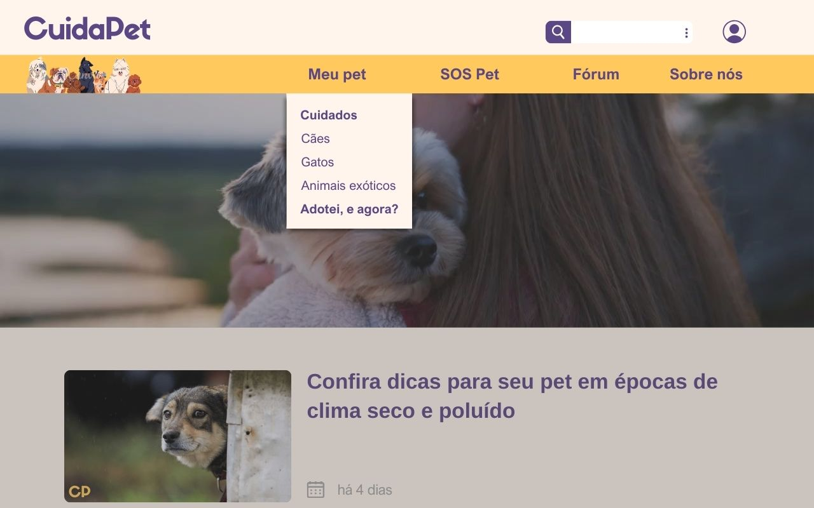
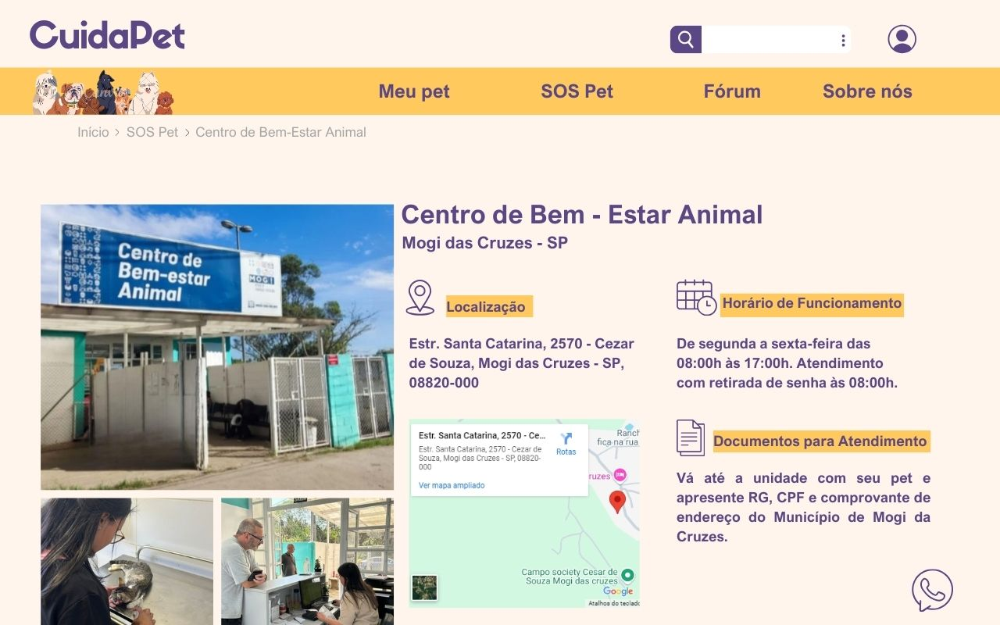
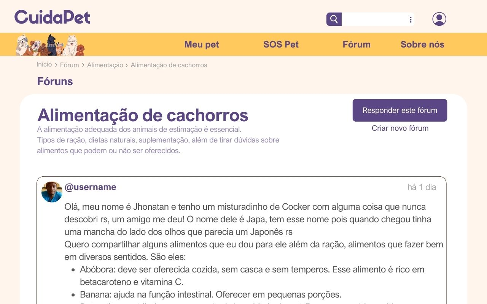
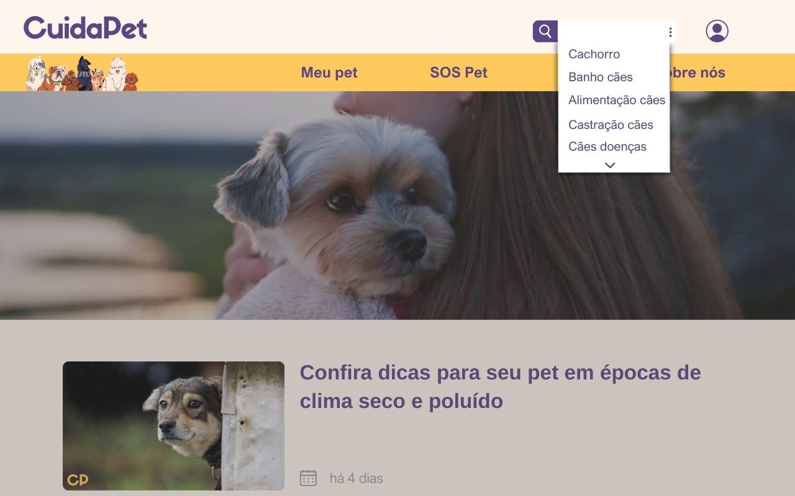

# Projeto de Interface

## User Flow

Fluxo de usuário (User Flow) é uma técnica que permite ao desenvolvedor mapear todo fluxo de navegação do usuário na aplicação. Essa técnica funciona para alinhar os caminhos e as possíveis ações que o usuário pode fazer junto com os membros de sua equipe.

</figure>

## Protótipo

### Protótipo de baixa fidelidade

Protótipos de baixa fidelidade apresentam de forma simplificada o design da interface e o relacionamento entre suas páginas, permitindo evolução da proposta da solução. Neste projeto, os utilizaremos para apoiar a validação dos requisitos e efetuar mudanças dos mesmos, caso seja necessário, para menor impacto na codificação da aplicação.

## Página de Login

<figura>
  

## Caixa de sugestão em aba "Meu Pet"

<figura>
  

## Página "SOS Pet"

<figura>
  

## Página do Forum

<figura>
  

## Caixa de sugestão em Barra de Pesquisa

<figura>
  

