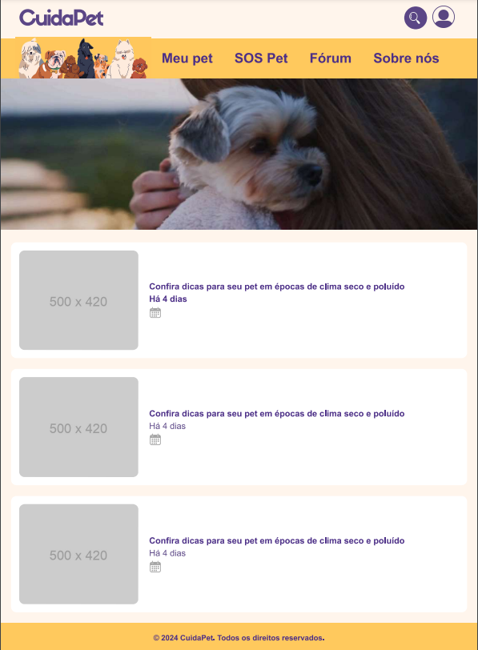

# Template padrão da Aplicação

O layout padrão do site foi construído com as linguagens de marcação HTML e CSS, e a linguagem de programação JavaScript foi utilizada para a construção do menu responsivo.

As páginas terão como elementos padrões o menu de navegação, o header e o footer, além dos elementos de identidade visual citados abaixo:

<ul>
<li>Cores: RGB: #fff5ec #ffdb38 #5b4686;</li>
<li>Font-family: SiffonPro e Arial.</li>
<li>Font-size: 16px 25px e 40px. </li>
</ul>

<h3><b>Tela de visualização da Página inicial</b></h3>

A página inicial exibe um vídeo de capa que reflete o tema central da aplicação, acompanhada de tópicos sobre temas atuais para manter os usuários informados e engajados.

<figure> 
  
  <figcaption> Figura 1 - Tela inicial 
</figure> 

<h3><b>Tela de visualização da Página Meu Pet/ Meu cãozinho</b></h3>

 Está exibe um informações sobre cuidados relacionados aos caninos, acompanhada de tópicos sobre temas mais relevantes com intuito de manter os usuários informados.

<figure> 
  
  <figcaption> Figura 1 - Meu Pet/ Meu cãozinho 
</figure> 

