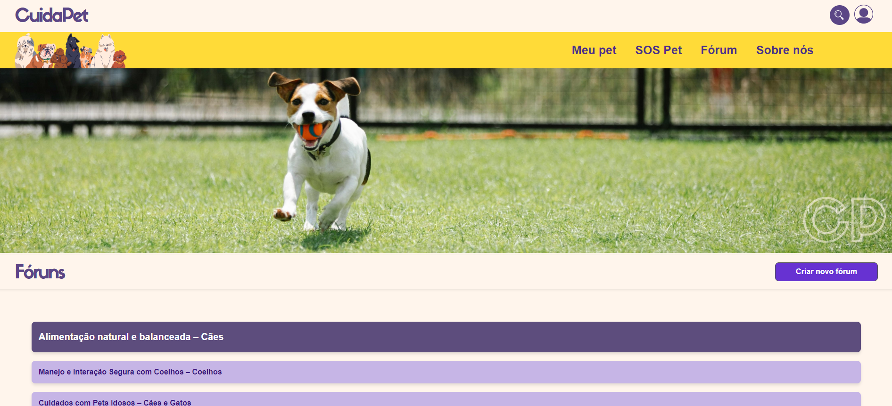
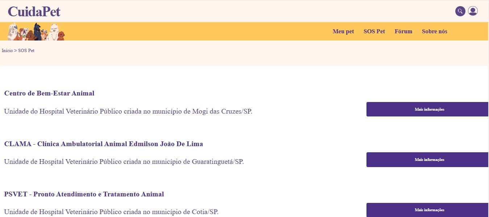
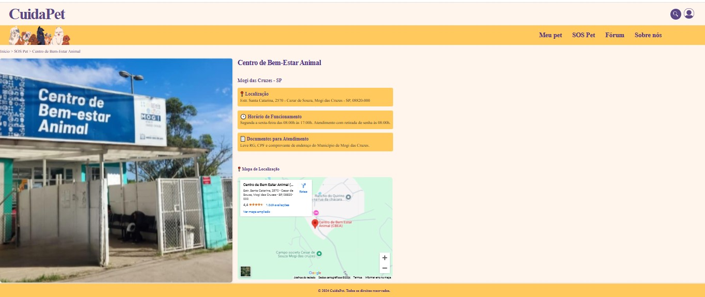
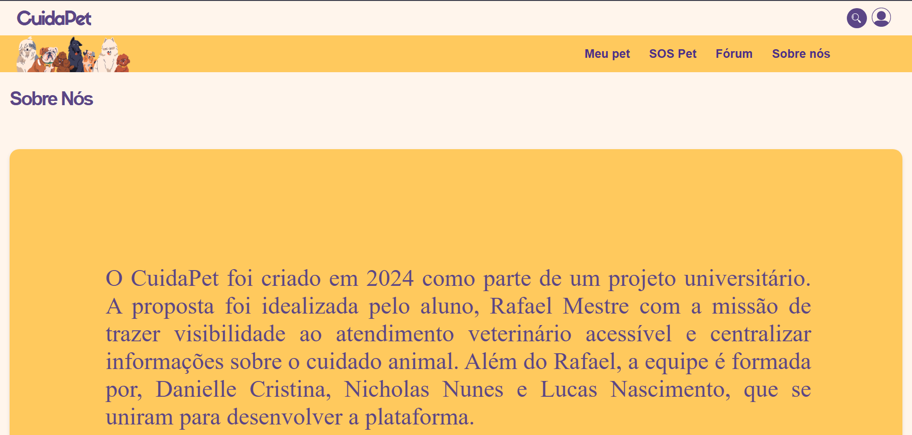
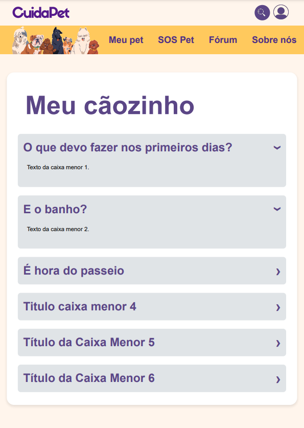

# Programação de Funcionalidades

### Tela de Fórum (RF-02)

<figure> 
  

#### Requisito atendido

RF-02: A aplicação deve ter um fórum para que os usuários possam interagir entre os tópicos postados

#### Artefatos da funcionalidade

● forum.html

● forum.css

#### Instruções de acesso

[Adicione as orientações de acesso à funcionalidade]

#### Responsável

Rafael Mestre A. Araujo

### Tela SOS Pet (RF-01, RF-04 e RF-05)

<figure> 
  

<figure> 
  
  
#### Requisitos atendidos

RF-01: A aplicação deve permitir que o usuário encontre unidades veterinárias públicas e subsidiadas e tenha acesso a informações sobre localizações, contatos e especialidades

RF-04: A aplicação deverá ter botões que direcione o usuário para apps de comunicação como WhatsApp e E-mail, com as unidades veterinárias

RF-05: A aplicação deverá oferecer uma opção de direcionamento ao usuário para aplicativos de localização, como Google Maps, para as unidades veterinárias.
#### Artefatos da funcionalidade

● SoSPetMain.html

● SoSPetMain.css

● CentrodeBemEstarAnimal.html

● CentrodeBemEstarAnimal.css

#### Instruções de acesso

Os usuários devem selecionar uma das unidades para visualizar as demais informações sobre as clínicas.

#### Responsável

Danielle Cristina Pereira

 

### Titulo da funcionalidade

<figure> 
  

#### Requisito atendido

RF-??

#### Artefatos da funcionalidade

● sobrenos.html
● sobrenos.css

#### Instruções de acesso

[Adicione as orientações de acesso à funcionalidade]

#### Responsável

Lucas Hermógenes

### Tela Meu Pet/ Meu Cãozinho (RF-06) (RNF-03)

<figure> 
  

#### Requisito atendido

(RF-06) A aplicação deverá fornecer informações ao usuário sobre cuidados diários com os pets.

(RNF-03)	A aplicação deve apresentar uma interface intuitiva que permita o usuário encontrar dicas diárias e clínicas veterinárias em até quatro cliques.

#### Artefatos da funcionalidade

● meupet.html

● meupet.css

● meupet.js

#### Instruções de acesso

Os usuários devem iteragir com algum dos temas para checar informações relacionadas.

#### Responsável

Nicholas Nunes

